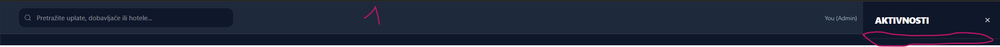

# SQL Integracija - Vodič za nove funkcionalnosti

Ovaj dokument opisuje kako dodati nove elementi u aplikaciju sa ispravnom SQL integracijom.

## Koraci za dodavanje novog elementa:

### 1. Ažuriraj TypeScript interface (src/app/page.tsx)
```typescript
interface NewEntity {
  id: string;
  // ... sva polja koja trebaju
  createdAt?: string;
}
```

### 2. Dodaj tabelu u SQL shemu (src/lib/db.ts)
```typescript
export const newEntities = sqliteTable('new_entities', {
  id: text('id').primaryKey(),
  // ... sva polja
  createdAt: integer('created_at', { mode: 'timestamp' }).default(sql`CURRENT_TIMESTAMP`),
});
```

### 3. Kreiraj API route (src/app/api/new-entities/route.ts)
```typescript
import { NextRequest, NextResponse } from 'next/server';
import { db } from '@/lib/drizzle';
import { newEntities } from '@/lib/db';
import { eq } from 'drizzle-orm';

// GET - Učitaj sve
export async function GET() {
  try {
    const data = await db.select().from(newEntities);
    return NextResponse.json(data);
  } catch (error) {
    console.error('Error fetching:', error);
    return NextResponse.json({ error: 'Failed to fetch' }, { status: 500 });
  }
}

// POST - Dodaj novo
export async function POST(request: NextRequest) {
  try {
    const body = await request.json();
    await db.insert(newEntities).values({
      id: body.id,
      // ... sva polja
    });
    return NextResponse.json({ success: true });
  } catch (error) {
    console.error('Error creating:', error);
    return NextResponse.json({ error: 'Failed to create' }, { status: 500 });
  }
}

// PUT - Ažuriraj
export async function PUT(request: NextRequest) {
  try {
    const body = await request.json();
    await db.update(newEntities).set({
      // ... sva polja
    }).where(eq(newEntities.id, body.id));
    return NextResponse.json({ success: true });
  } catch (error) {
    console.error('Error updating:', error);
    return NextResponse.json({ error: 'Failed to update' }, { status: 500 });
  }
}

// DELETE - Obriši
export async function DELETE(request: NextRequest) {
  try {
    const body = await request.json();
    await db.delete(newEntities).where(eq(newEntities.id, body.id));
    return NextResponse.json({ success: true });
  } catch (error) {
    console.error('Error deleting:', error);
    return NextResponse.json({ error: 'Failed to delete' }, { status: 500 });
  }
}
```

### 4. U komponenti (src/app/page.tsx):

**Dodaj state za podatke:**
```typescript
const [newEntities, setNewEntities] = useState<NewEntity[]>([]);
const [newEntityForm, setNewEntityForm] = useState<Partial<NewEntity>>({...});
```

**Dodaj funkcije za CRUD:**
```typescript
// Učitaj sa baze
const fetchNewEntities = async () => {
  try {
    const response = await fetch('/api/new-entities');
    const data = await response.json();
    setNewEntities(data);
    saveToStorage('newEntities', data); // Backup u localStorage
  } catch (error) {
    console.error('Error:', error);
  }
};

// Dodaj novi
const addNewEntity = async () => {
  if (!newEntityForm.field1) return;
  
  const newEntity: NewEntity = {
    id: Date.now().toString(),
    // ... sva polja
  };
  
  try {
    // Spremi u SQL
    await fetch('/api/new-entities', {
      method: 'POST',
      headers: { 'Content-Type': 'application/json' },
      body: JSON.stringify(newEntity),
    });
    
    // Ažuriraj lokalno stanje
    const updated = [...newEntities, newEntity];
    setNewEntities(updated);
    saveToStorage('newEntities', updated);
    logActivity('Dodao novi element', newEntity.field1);
    
    // Resetuj formu
    setNewEntityForm({...defaultValues});
  } catch (error) {
    console.error('Error adding:', error);
  }
};

// Ažuriraj
const editNewEntity = async () => {
  try {
    await fetch('/api/new-entities', {
      method: 'PUT',
      headers: { 'Content-Type': 'application/json' },
      body: JSON.stringify(newEntityForm),
    });
    
    const updated = newEntities.map(e => 
      e.id === newEntityForm.id ? newEntityForm as NewEntity : e
    );
    setNewEntities(updated);
    saveToStorage('newEntities', updated);
  } catch (error) {
    console.error('Error updating:', error);
  }
};

// Obriši
const deleteNewEntity = async (id: string) => {
  try {
    await fetch('/api/new-entities', {
      method: 'DELETE',
      headers: { 'Content-Type': 'application/json' },
      body: JSON.stringify({ id }),
    });
    
    const updated = newEntities.filter(e => e.id !== id);
    setNewEntities(updated);
    saveToStorage('newEntities', updated);
  } catch (error) {
    console.error('Error deleting:', error);
  }
};
```

**Učitaj podatke pri početku:**
```typescript
useEffect(() => {
  // Prvo učitaj iz baze ako je dostupna
  fetchNewEntities().catch(() => {
    // Ako baza nije dostupna, koristi localStorage
    const data = JSON.parse(localStorage.getItem('isplateData') || '{}');
    setNewEntities(data.newEntities || []);
  });
}, []);
```

## Pravila za SQL integraciju:

✅ **OBAVEZNO:**
1. Kreiraj SQL tabelu za svaki novi entitet
2. Kreiraj API route sa GET, POST, PUT, DELETE
3. U komponenti pozovi API umjesto direktnog čuvanja u localStorage
4. Uvijek imaj fallback na localStorage ako baza ne radi
5. Loguj sve akcije u activityLogs

❌ **IZBJEGAVATI:**
1. Ne čuvaj samo u localStorage bez baze
2. Ne prezeri greške iz API poziva
3. Ne zaboravi resetati formu nakon dodavanja
4. Ne pozabi logirati akciju

## Primjer: Dodaj polje "prioritet" u payments

### 1. Ažuriraj Payment interface:
```typescript
interface Payment {
  // ... postojeća polja
  priority?: 'low' | 'medium' | 'high';
}
```

### 2. Ažuriraj payments tabelu u db.ts:
```typescript
export const payments = sqliteTable('payments', {
  // ... postojeća polja
  priority: text('priority').default('medium'),
});
```

### 3. Ažuriraj /api/payments/route.ts:
- Dodaj `priority: body.priority` u POST i PUT

### 4. U page.tsx:
- Dodaj `priority: 'medium'` u paymentForm state
- Dodaj priority polje u formu
- Ažuriraj addPayment() da čuva priority

## Kako znati da je sve ispravno?

✓ Podaci se čuvaju i učitavaju posle osvježavanja stranice
✓ Nema greške u konzoli (F12 → Console)
✓ API je pozvan (F12 → Network)
✓ Aktivnost je zabilježena u "Poslednje aktivnosti"
✓ TypeScript nema greške (`npx tsc --noEmit`)

---

**Važno:** Svaki put prije nego što dodam nešto novo, slijedi ove korake! Ovo osigurava da će sve biti trajno čuvano.
